# Handball Analytics - System Architecture

**Version:** 3.2 (Merged)
**Dato:** 2026-01-20
**Status:** Production

---

## 📋 Innholdsfortegnelse

### Del 1: Visual Architecture
1. [System Overview](#1-system-overview)
2. [Fil-avhengigheter](#2-fil-avhengigheter)
3. [Dataflyt: Skuddregistrering](#3-dataflyt-skuddregistrering)
4. [Lagringsstrategi](#4-lagringsstrategi)
5. [State Management](#5-state-management)
6. [Firebase Arkitektur](#6-firebase-arkitektur)
7. [UI Rendering Flow](#7-ui-rendering-flow)
8. [Event Handling Strategy](#8-event-handling-strategy)

### Del 2: Implementation Details
9. [Filstruktur](#9-filstruktur)
10. [Moduler og Ansvar](#10-moduler-og-ansvar)
11. [Arkitekturprinsipper](#11-arkitekturprinsipper)
12. [Skuddregistreringsflyt (Detailed)](#12-skuddregistreringsflyt-detailed)
13. [Autentiseringsflyt](#13-autentiseringsflyt)
14. [Lagringsarkitektur (Details)](#14-lagringsarkitektur-details)
15. [Sikkerhetsarkitektur](#15-sikkerhetsarkitektur)
16. [Ytelsesoptimalisering](#16-ytelsesoptimalisering)
17. [Fremtidig Arkitektur](#17-fremtidig-arkitektur)
18. [Arkitektur-Insights](#18-arkitektur-insights)

---

# DEL 1: VISUAL ARCHITECTURE

## 1. SYSTEM OVERVIEW

### High-Level Architecture

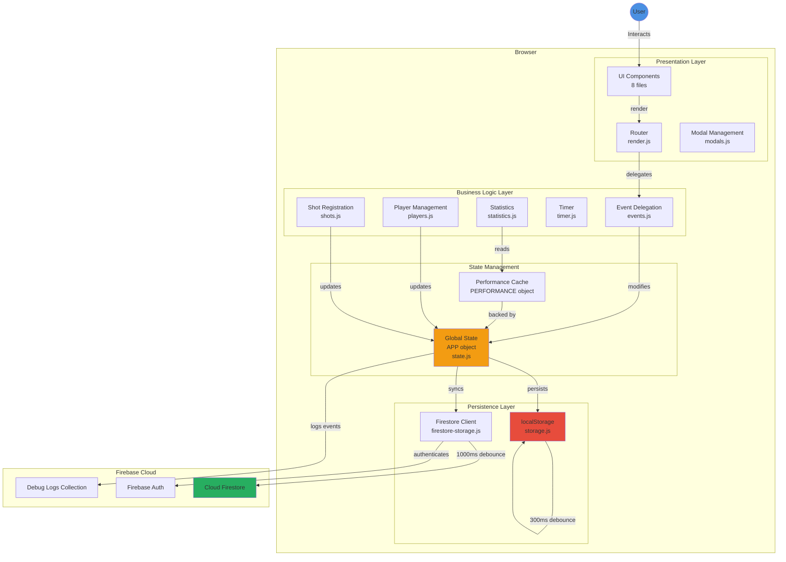

### Technology Stack

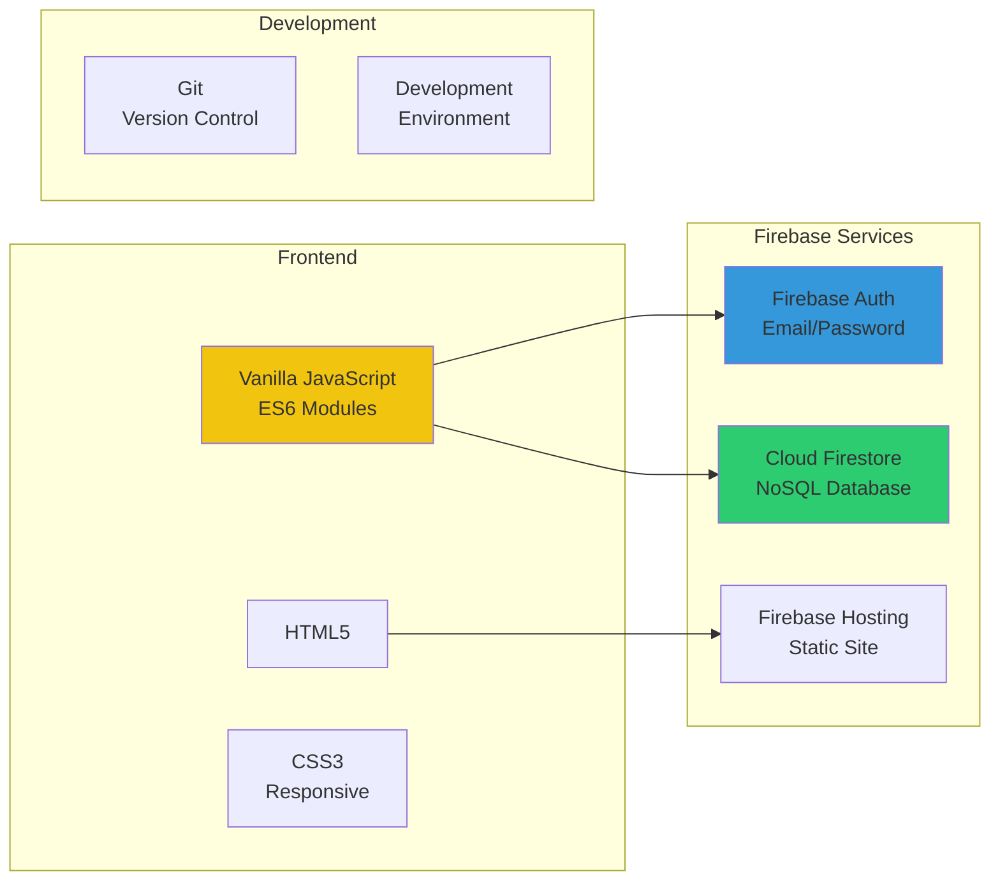

---

## 2. FIL-AVHENGIGHETER

### Complete Dependency Graph

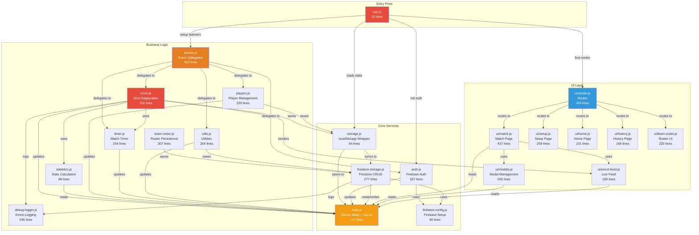

### Critical Path for Shot Registration

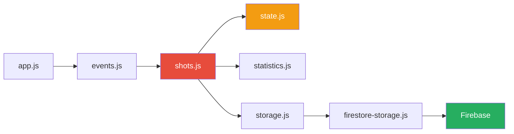

---

## 3. DATAFLYT: SKUDDREGISTRERING

### Complete Shot Registration Flow

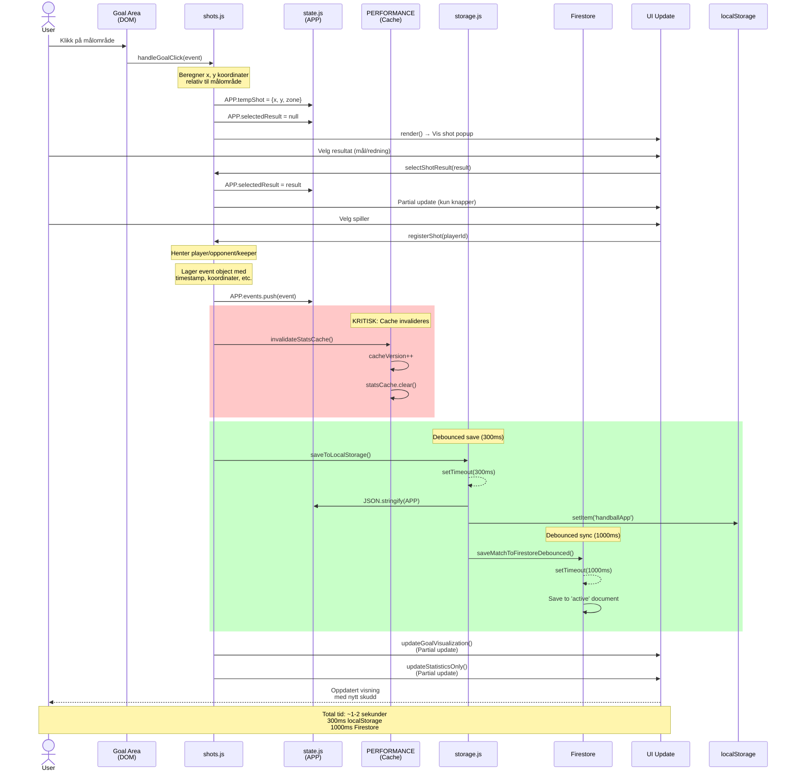

### Shot Event Object Structure

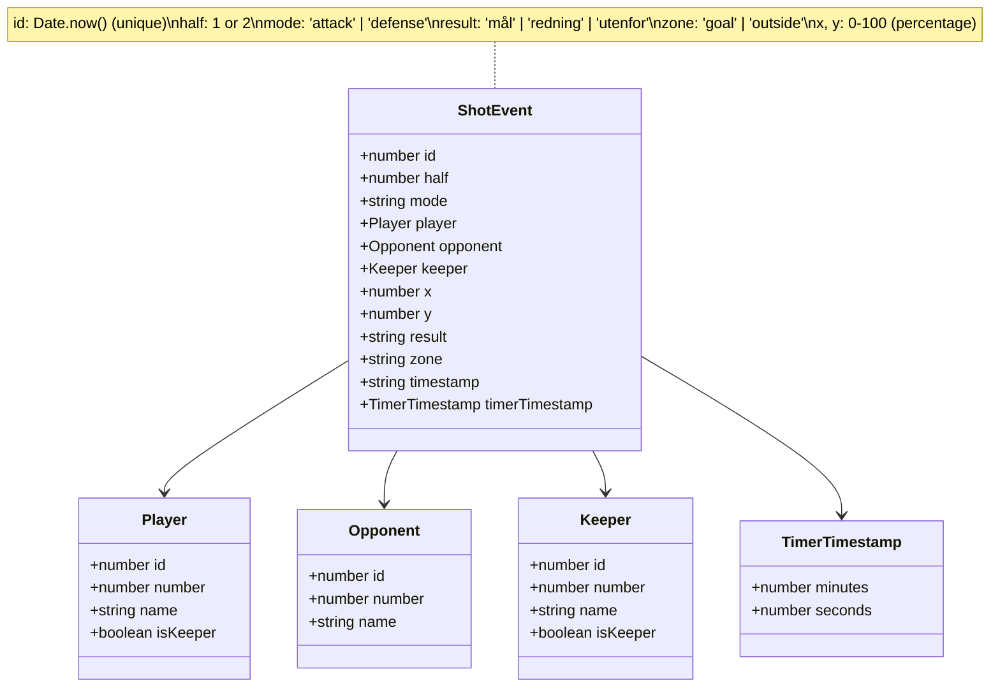

### Coordinate System

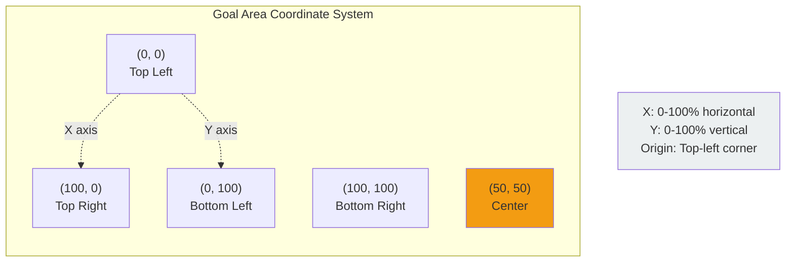

---

## 4. LAGRINGSSTRATEGI

### Dual Storage Architecture

```mermaid
graph TB
    subgraph "Application State"
        APP[APP Object<br/>In-Memory State]
    end

    subgraph "Local Storage Strategy"
        LocalSave[saveToLocalStorage<br/>Debounce: 300ms]
        LocalData[(localStorage<br/>'handballApp')]
        LocalLoad[loadFromLocalStorage<br/>On App Start]
    end

    subgraph "Cloud Storage Strategy"
        FirestoreSave[saveMatchToFirestore<br/>Debounce: 1000ms]
        FirestoreData[(Firestore<br/>users/{uid}/matches)]
        FirestoreLoad[syncFromFirestore<br/>On Auth]
    end

    subgraph "Sync Events"
        Event1[New Shot]
        Event2[Player Added]
        Event3[Match Finished]
        Event4[Setup Reset]
    end

    Event1 --> APP
    Event2 --> APP
    Event3 --> APP
    Event4 --> APP

    APP -->|Triggers| LocalSave
    LocalSave -->|After 300ms| LocalData

    APP -->|Triggers| FirestoreSave
    FirestoreSave -->|After 1000ms| FirestoreData

    LocalData -->|On Reload| LocalLoad
    LocalLoad -->|Restores| APP

    FirestoreData -->|On Login| FirestoreLoad
    FirestoreLoad -->|Overwrites| APP

    style APP fill:#f39c12,color:#fff
    style LocalData fill:#e74c3c,color:#fff
    style FirestoreData fill:#27ae60,color:#fff
```

### Storage Comparison

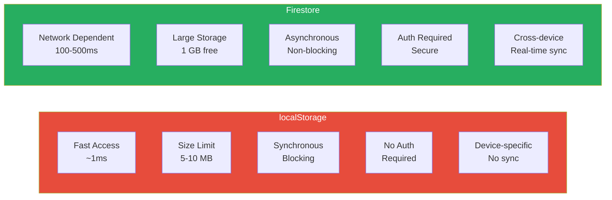

### Data Flow Priority


### Save Debouncing Strategy

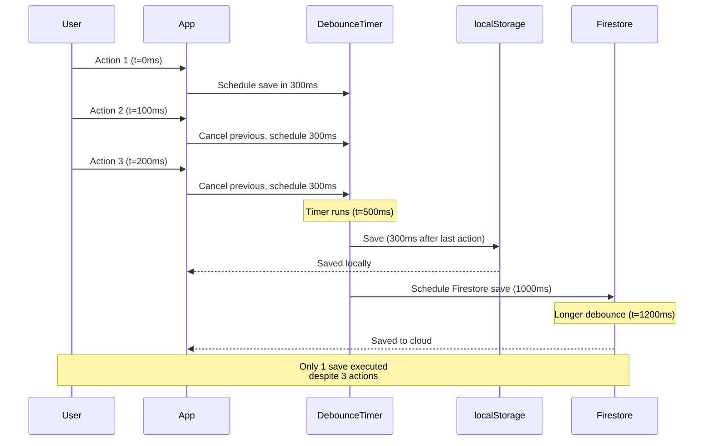

---

## 5. STATE MANAGEMENT

### Global APP Object Structure

```mermaid
graph TB
    subgraph "APP Object (state.js)"
        subgraph "User State"
            currentUser[currentUser<br/>Firebase User]
        end

        subgraph "Navigation State"
            page[page: string<br/>'home'|'match'|'setup'|etc]
        end

        subgraph "Match Configuration"
            homeTeam[homeTeam: string]
            awayTeam[awayTeam: string]
            matchDate[matchDate: string]
            currentHalf[currentHalf: 1|2]
            matchMode[matchMode: 'simple'|'advanced']
        end

        subgraph "Teams"
            players[players: Array~Player~]
            opponents[opponents: Array~Opponent~]
            activeKeeper[activeKeeper: Keeper]
        end

        subgraph "Match Events"
            events[events: Array~ShotEvent~]
            mode[mode: 'attack'|'defense']
        end

        subgraph "Timer State (Advanced)"
            timerState[timerState: Object<br/>currentTime, isRunning,<br/>duration, intervalId]
        end

        subgraph "Temporary UI State"
            tempShot[tempShot: {x, y, zone}]
            selectedResult[selectedResult: string]
            tempPlayersList[tempPlayersList: Array]
            editingPlayerId[editingPlayerId: number]
        end

        subgraph "History"
            completedMatches[completedMatches: Array~Match~]
            viewingMatch[viewingMatch: Match]
        end

        subgraph "Saved Rosters"
            savedTeams[savedTeams: Array~TeamRoster~]
        end
    end

    style APP fill:#f39c12,color:#fff
    style events fill:#e74c3c,color:#fff
    style tempShot fill:#3498db,color:#fff
```

### Performance Cache Structure

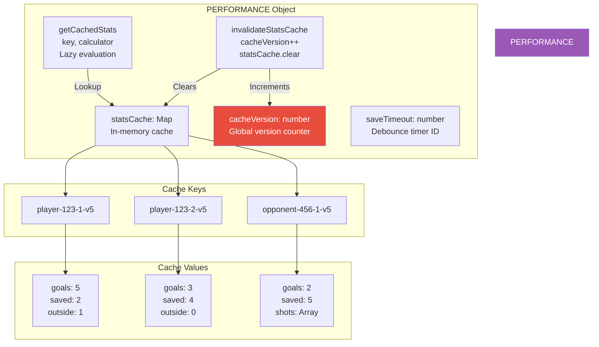

### Cache Invalidation Flow

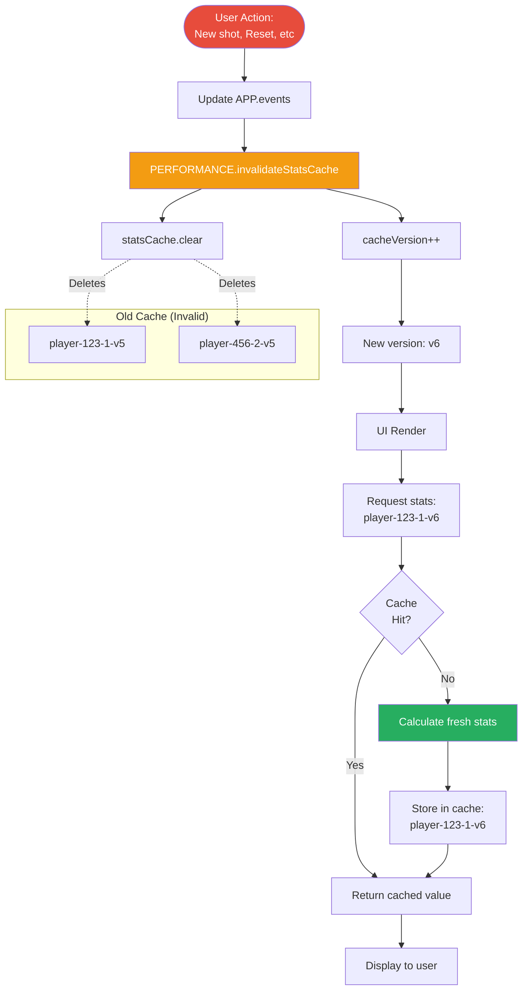

---

## 6. FIREBASE ARKITEKTUR

### Firestore Database Schema

```mermaid
graph TB
    subgraph "Firestore Database"
        root[(Cloud Firestore)]

        subgraph "Users Collection"
            users[users/]
            user1[{uid1}]
            user2[{uid2}]

            users --> user1
            users --> user2
        end

        root --> users

        subgraph "User Document Fields"
            userFields["email: string<br/>name: string<br/>homeTeam: string<br/>migrated: boolean<br/>migratedAt: timestamp"]
        end

        user1 --> userFields

        subgraph "Matches Subcollection"
            matches[matches/]
            activeDoc['active']
            match1[{matchId1}]
            match2[{matchId2}]

            matches --> activeDoc
            matches --> match1
            matches --> match2
        end

        user1 --> matches

        subgraph "Match Document Fields"
            matchFields["homeTeam: string<br/>awayTeam: string<br/>matchDate: string<br/>currentHalf: 1|2<br/>players: Array<br/>opponents: Array<br/>events: Array<br/>activeKeeper: Object<br/>mode: string<br/>status: 'active'|'completed'<br/>updatedAt: timestamp<br/>completedAt: timestamp"]
        end

        activeDoc --> matchFields
        match1 --> matchFields

        subgraph "Debug Logs Collection"
            debugLogs[debug-logs/]
            log1[{logId1}]
            log2[{logId2}]

            debugLogs --> log1
            debugLogs --> log2
        end

        root --> debugLogs

        subgraph "Debug Log Fields"
            logFields["userId: string<br/>userEmail: string<br/>eventType: string<br/>data: Object<br/>timestamp: string<br/>appVersion: string<br/>browser: string"]
        end

        log1 --> logFields
    end

    style root fill:#27ae60,color:#fff
    style users fill:#3498db,color:#fff
    style debugLogs fill:#e67e22,color:#fff
```

### Firebase Authentication Flow

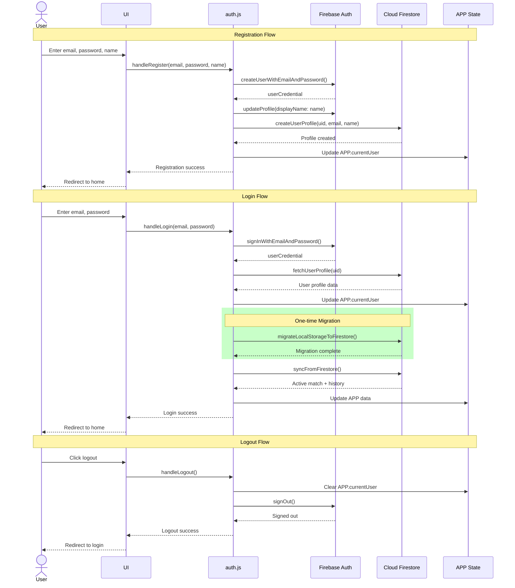

### Firestore Operations

```mermaid
graph TB
    subgraph "Read Operations"
        R1[loadActiveMatchFromFirestore<br/>Load current match]
        R2[loadCompletedMatchesFromFirestore<br/>Load history]
        R3[fetchUserProfile<br/>Load user data]
        R4[fetchSavedTeams<br/>Load rosters]
    end

    subgraph "Write Operations"
        W1[saveMatchToFirestore<br/>Save active match<br/>debounced 1000ms]
        W2[saveCompletedMatchToFirestore<br/>Archive finished match]
        W3[createUserProfile<br/>Create user document]
        W4[saveTeamRoster<br/>Save team list]
    end

    subgraph "Delete Operations"
        D1[deleteCompletedMatchFromFirestore<br/>Remove match from history]
        D2[deleteTeamRoster<br/>Remove saved team]
    end

    subgraph "Special Operations"
        S1[migrateLocalStorageToFirestore<br/>One-time data migration]
        S2[syncFromFirestore<br/>Full sync on login]
    end

    subgraph "Firestore Collections"
        C1[(users/{uid})]
        C2[(users/{uid}/matches)]
        C3[(debug-logs)]
    end

    R1 --> C2
    R2 --> C2
    R3 --> C1
    R4 --> C1

    W1 --> C2
    W2 --> C2
    W3 --> C1
    W4 --> C1

    D1 --> C2
    D2 --> C1

    S1 --> C1
    S1 --> C2
    S2 --> C1
    S2 --> C2

    style C1 fill:#3498db,color:#fff
    style C2 fill:#27ae60,color:#fff
    style C3 fill:#e67e22,color:#fff
```

---

## 7. UI RENDERING FLOW

### Page Routing System

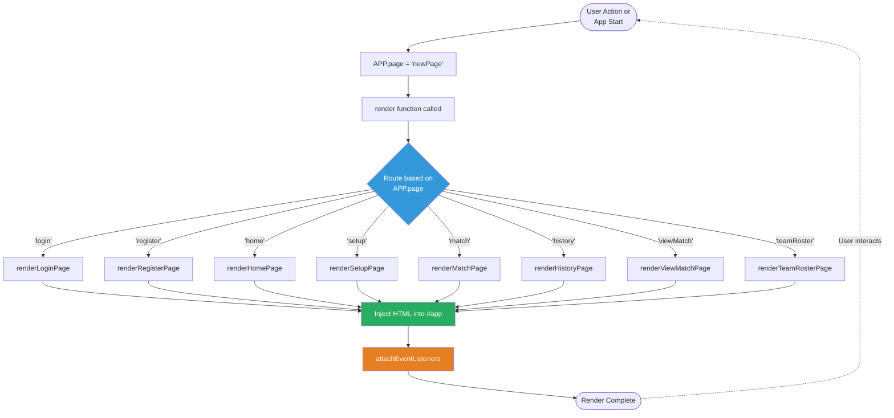

### Rendering Strategy

```mermaid
graph TB
    subgraph "Full Re-render (Heavy)"
        F1[User navigates to new page]
        F2[APP.page changes]
        F3[render called]
        F4[Entire #app innerHTML replaced]
        F5[All event listeners re-attached]
    end

    subgraph "Partial Update (Optimized)"
        P1[User registers shot]
        P2[Event data added to APP.events]
        P3[updateGoalVisualization]
        P4[Only shot markers updated]
        P5[updateStatisticsOnly]
        P6[Only stats section updated]
    end

    subgraph "Modal Update (Lazy)"
        M1[User selects shot result]
        M2[APP.selectedResult updated]
        M3[selectShotResult]
        M4[Only result buttons updated]
        M5[No full re-render]
    end

    F1 --> F2 --> F3 --> F4 --> F5
    P1 --> P2 --> P3 --> P4
    P2 --> P5 --> P6
    M1 --> M2 --> M3 --> M4 --> M5

    style F4 fill:#e74c3c,color:#fff
    style P4 fill:#27ae60,color:#fff
    style P6 fill:#27ae60,color:#fff
    style M4 fill:#f39c12,color:#fff
```

---

## 8. EVENT HANDLING STRATEGY

### Global Event Delegation

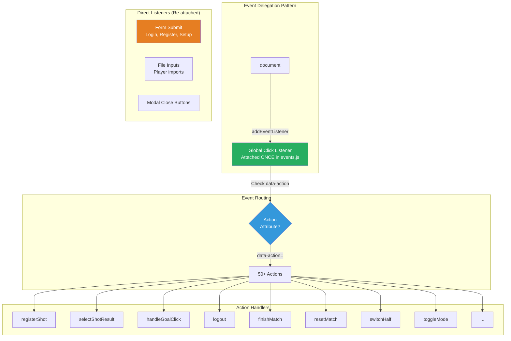

### Event Flow Example

```mermaid
sequenceDiagram
    actor User
    participant DOM
    participant GlobalListener
    participant EventsJS as events.js
    participant ShotsJS as shots.js
    participant State as APP State
    participant UI

    User->>DOM: Click button<br/>data-action="registerShot"<br/>data-player-id="123"
    DOM->>GlobalListener: click event bubbles up
    GlobalListener->>EventsJS: Check e.target.dataset.action

    EventsJS->>EventsJS: action === 'registerShot'
    EventsJS->>ShotsJS: registerShot(playerId=123)

    ShotsJS->>State: APP.events.push(event)
    ShotsJS->>State: PERFORMANCE.invalidateStatsCache()
    ShotsJS->>UI: updateGoalVisualization()
    ShotsJS->>UI: updateStatisticsOnly()

    UI-->>User: Updated display

    Note over GlobalListener,EventsJS: Single listener handles<br/>all actions via delegation
```

---

# DEL 2: IMPLEMENTATION DETAILS

## 9. FILSTRUKTUR

```
handballstats/
├── index.html                      # Inngangspunkt
├── styles.css                      # Global styling
├── firebase.json                   # Firebase hosting config
├── firestore.rules                 # Firestore security rules
├── ARCHITECTURE.md                 # Dette dokumentet
├── DEVELOPMENT_RULES.md            # Utviklingsregler (RED/YELLOW/GREEN zones)
├── SECURITY_RULES.md               # Sikkerhetsregler (auth, validation, XSS)
├── TEST_GUIDE.md                   # Testing guide
├── STORAGE-ANALYSIS-REPORT.md      # Storage architecture analysis
├── js/
│   ├── app.js                      # Main entry point (22 lines)
│   ├── state.js                    # Global state management (127 lines)
│   ├── storage.js                  # localStorage operations (64 lines)
│   ├── firebase-config.js          # Firebase initialization (48 lines)
│   ├── firestore-storage.js        # Firestore operations (277 lines)
│   ├── auth.js                     # Authentication logic (327 lines)
│   ├── events.js                   # Global event handling (562 lines)
│   ├── shots.js                    # Shot registration logic (368 lines)
│   ├── players.js                  # Player management (229 lines)
│   ├── team-roster.js              # Team roster management (307 lines)
│   ├── match.js                    # Match state management
│   ├── history.js                  # Match history
│   ├── timer.js                    # Match timer (204 lines)
│   ├── statistics.js               # Stats calculation (48 lines)
│   ├── utils.js                    # Utilities (264 lines)
│   ├── debug-logger.js             # Debug logging system (245 lines)
│   └── ui/
│       ├── render.js               # Main rendering orchestrator (354 lines)
│       ├── login.js                # Login page
│       ├── register.js             # Registration page
│       ├── reset-password.js       # Password reset page
│       ├── home.js                 # Home page (101 lines)
│       ├── setup.js                # Match setup page (259 lines)
│       ├── match.js                # Match page (427 lines)
│       ├── history.js              # Match history page (168 lines)
│       ├── view-match.js           # View completed match
│       ├── team-roster.js          # Team roster page (220 lines)
│       ├── modals.js               # Modal management (255 lines)
│       ├── event-feed.js           # Live feed (189 lines)
│       └── help.js                 # Help page
└── tests/                          # Test files (Vitest)
    ├── shots.test.js
    ├── state.test.js
    ├── storage.test.js
    └── ...
```

---

## 10. MODULER OG ANSVAR

### Core Modules

#### `app.js`
- **Ansvar:** Application bootstrap
- **Funksjoner:**
  - Initialiserer app ved DOMContentLoaded
  - Loader state fra localStorage
  - Setup global event listeners
  - Initialiserer Firebase auth observer
  - Trigger initial rendering

#### `state.js`
- **Ansvar:** Global state management
- **Exports:**
  - `APP` - Global state object
  - `PERFORMANCE` - Performance optimization utilities
  - Helper functions for accessing current match data
  - `generateUniqueId()` - Unique ID generator for players

**APP State Structure:**
```javascript
{
  // Auth
  currentUser: {uid, email, displayName, homeTeam} | null,

  // Navigation
  page: 'login' | 'register' | 'reset-password' | 'home' | 'setup' |
        'match' | 'history' | 'viewMatch' | 'teamRoster' | 'help',

  // Match Configuration
  matchMode: 'simple' | 'advanced',
  shotRegistrationMode: 'simple' | 'detailed',
  timerConfig: { halfLength: 20 | 25 | 30 },

  // Match Data
  homeTeam: string,
  awayTeam: string,
  matchDate: string,
  currentHalf: number,
  players: Player[],
  opponents: Player[],
  activeKeeper: Player | null,
  mode: 'attack' | 'defense',
  events: Event[],

  // Shot Registration State
  tempShot: Shot | null,
  selectedResult: 'mål' | 'redning' | null,
  selectedShooter: playerId | null,
  selectedAttackType: 'etablert' | 'kontring' | null,
  selectedShotPosition: '9m' | '6m' | '7m' | 'ka' | null,
  selectedAssist: playerId | null,
  showShotDetails: boolean,
  shotDetailsData: object | null,

  // Match History
  completedMatches: Match[],
  viewingMatch: Match | null,

  // Team Roster
  savedTeams: SavedTeam[],
  editingTeamId: number | null,
  importingTeamId: number | null,

  // Player Management
  managingTeam: 'players' | 'opponents' | null,
  tempPlayersList: Player[],
  editingPlayerId: number | null,

  // Timer (Advanced Mode)
  timerState: {
    isRunning: boolean,
    currentTime: number,
    intervalId: number | null
  },

  // Internal
  _idCounter: number,
  isImportingFile: boolean
}
```

#### `storage.js`
- **Ansvar:** localStorage operations
- **Funksjoner:**
  - `saveToLocalStorage()` - Debounced save (300ms)
  - `saveToLocalStorageImmediate()` - Immediate save
  - `loadFromLocalStorage()` - Load state on app start

#### `firebase-config.js`
- **Ansvar:** Firebase initialization
- **Exports:** `auth`, `db`, `firebase`

#### `firestore-storage.js`
- **Ansvar:** Cloud storage operations
- **Funksjoner:**
  - `saveMatchToFirestore()` - Save active match
  - `saveMatchToFirestoreDebounced()` - Debounced (1000ms)
  - `loadMatchFromFirestore()` - Load active match
  - `saveCompletedMatchToFirestore()` - Save completed match
  - `loadCompletedMatchesFromFirestore()` - Load all completed
  - `deleteCompletedMatchFromFirestore()` - Delete match
  - `migrateLocalStorageToFirestore()` - First-time migration
  - `syncFromFirestore()` - Sync data on login

**Firestore Structure:**
```
/users/{userId}/
  ├── settings (document)          [FUTURE]
  │   └── preferences
  ├── teamRosters/ (collection)    [FUTURE]
  │   └── {rosterId} (document)
  └── matches/ (collection)
      ├── active (document)        [CURRENT]
      └── {matchId} (document)     [CURRENT]
```

#### `auth.js`
- **Ansvar:** Authentication and user management
- **Funksjoner:**
  - `validateEmail()`, `validatePassword()`
  - `handleRegister()`, `handleLogin()`, `handleLogout()`
  - `handlePasswordReset()`
  - `startNewMatch()` - Reset all match data
  - `continueMatchSetup()` - Continue existing setup
  - `initAuthStateObserver()` - Firebase auth state listener

---

### Business Logic Modules

#### `shots.js` (RED ZONE)
- **Ansvar:** Shot registration logic
- **Funksjoner:**
  - `handleGoalClick()` - Click on goal visualization
  - `selectResult()` - Select mål/redning
  - `selectShooter()` - Select shooter (detailed mode)
  - `selectAttackType()` - Select etablert/kontring
  - `selectShotPosition()` - Select 9m/6m/7m/ka
  - `selectAssist()` - Select assist player
  - `skipAssist()` - Skip assist selection
  - `registerShot()` - Final shot registration
  - `registerTechnicalError()` - Register technical error
  - `deleteEvent()` - Delete event

**Shot Registration Flow (Detailed Mode):**
```
1. User clicks goal → tempShot created
2. User selects result → selectedResult set
3. User selects shooter → selectedShooter set
4. User selects attack type → selectedAttackType set
5. User selects shot position → selectedShotPosition set
6. If goal: User selects assist or skips
7. registerShot() called → event created → state reset
```

#### `players.js` (YELLOW ZONE)
- **Ansvar:** Player management
- **Funksjoner:**
  - `addPlayer()`, `editPlayer()`, `deletePlayer()`
  - `setActiveKeeper()`, `removeActiveKeeper()`
  - `loadPlayersFromFile()` - Import from JSON/CSV/TXT

#### `team-roster.js`
- **Ansvar:** Team roster management
- **Funksjoner:**
  - `saveTeamRoster()` - Save current players as roster
  - `importTeamRoster()` - Import roster to match setup
  - `editTeamRoster()` - Edit saved roster
  - `deleteTeamRoster()` - Delete saved roster
  - `loadTeamRosterFromFile()` - Import roster from file

#### `match.js`
- **Ansvar:** Match state management
- **Funksjoner:**
  - `finishMatch()` - Complete and save match
  - `exportMatchData()` - Export to JSON
  - Statistics calculation helpers

#### `history.js`
- **Ansvar:** Match history management
- **Funksjoner:**
  - `viewMatch()` - View completed match details
  - `deleteMatch()` - Delete from history
  - `backToHistory()` - Navigate back

#### `timer.js` (YELLOW ZONE)
- **Ansvar:** Match timer (advanced mode only)
- **Funksjoner:**
  - `startTimer()`, `pauseTimer()`, `resetTimer()`
  - `setHalfLength()` - Configure half duration
  - `formatTime()` - Format seconds to MM:SS

#### `statistics.js` (RED ZONE)
- **Ansvar:** Calculate statistics from events
- **Funksjoner:**
  - Aggregate shot statistics per player/team
  - Used by shots.js and UI components

---

### UI Modules

All UI modules export a single render function that returns HTML string.

#### `ui/render.js`
- **Ansvar:** Main rendering orchestrator
- **Funksjoner:**
  - `render()` - Routes to correct page renderer
  - Attaches event listeners after rendering

#### `ui/login.js`, `ui/register.js`, `ui/reset-password.js`
- **Ansvar:** Authentication pages
- **Funksjoner:** `renderLoginPage()`, `renderRegisterPage()`, `renderResetPasswordPage()`

#### `ui/home.js`
- **Ansvar:** Home page
- **Funksjoner:**
  - `renderHomePage()` - Shows two buttons:
    - "Start ny kamp" - Calls `startNewMatch()`
    - "Fortsett kamp" - Calls `continueMatchSetup()` (only if data exists)

#### `ui/setup.js`
- **Ansvar:** Match setup page
- **Funksjoner:**
  - `renderSetupPage()` - Full setup interface
  - Match mode toggle (simple/advanced)
  - Shot registration mode toggle (simple/detailed) - only in advanced
  - Timer configuration - only in advanced
  - Player/opponent management
  - File import

#### `ui/match.js`
- **Ansvar:** Live match page
- **Funksjoner:**
  - `renderMatchPage()` - Full match interface
  - Goal visualization
  - Statistics tables
  - Shot popup (modal)
  - Timer display (advanced mode)

#### `ui/history.js`
- **Ansvar:** Match history list
- **Funksjoner:**
  - `renderHistoryPage()` - List all completed matches
  - View/delete actions

#### `ui/view-match.js`
- **Ansvar:** View completed match details
- **Funksjoner:**
  - `renderViewMatchPage()` - Read-only match view
  - Statistics and events from completed match

#### `ui/team-roster.js`
- **Ansvar:** Team roster management page
- **Funksjoner:**
  - `renderTeamRosterPage()` - List all saved rosters
  - Save/edit/delete/import actions

#### `ui/help.js`
- **Ansvar:** Help and documentation page
- **Funksjoner:**
  - `renderHelpPage()` - Comprehensive guide
  - Covers simple and advanced mode
  - Step-by-step instructions

---

## 11. ARKITEKTURPRINSIPPER

### 1. Separation of Concerns
Hver modul har et spesifikt ansvar:
- **UI-moduler:** Rendering av HTML
- **Business logic:** State management og databehandling
- **Storage:** Persistering av data
- **Events:** Håndtering av brukerinteraksjoner

### 2. Immutable State Updates
State oppdateres aldri direkte. Alle endringer går gjennom dedikerte funksjoner som:
1. Oppdaterer APP-objektet
2. Invaliderer cache
3. Trigger re-rendering
4. Lagrer til storage

### 3. Progressive Disclosure
UI viser kun relevant informasjon basert på:
- Valgt modus (simple/advanced)
- Valgt skuddregistreringsmodus (simple/detailed)
- Kampstatus (setup/active/completed)

### 4. Offline-First med Cloud Sync
- **Primær lagring:** localStorage (rask, offline)
- **Backup lagring:** Firestore (persistent, cross-device)
- **Hybrid modell:** Les lokalt, skriv til begge

---

## 12. SKUDDREGISTRERINGSFLYT (DETAILED)

### Simple Mode

1. User clicks goal/outside → `handleGoalClick()`
2. Modal shows: Mål/Redning buttons
3. User selects result → `selectResult()`
4. Modal shows: Player list
5. User selects player → `registerShot()`
6. Event created, stats updated, modal closed

### Detailed Mode (Advanced)

1. User clicks goal/outside → `handleGoalClick()`
2. Modal shows: **Mål/Redning** buttons
3. User selects result → `selectResult()`
4. Modal shows: **Velg skytter** (player list)
5. User selects shooter → `selectShooter()`
6. Modal shows: **Velg type angrep** (Etablert/Kontring)
7. User selects attack type → `selectAttackType()`
8. Modal shows: **Velg skuddposisjon** (9m/6m/7m/KA)
9. User selects position → `selectShotPosition()`
10. If goal: Modal shows **Velg assist** (player list + skip)
11. User selects assist or skips → `selectAssist()` or `skipAssist()`
12. `registerShot()` called automatically
13. Event created with full details, stats updated, modal closed

**Progressive Disclosure:**
- Only one step visible at a time
- Previous selections shown at top
- No scrolling needed on mobile

**Event Data Structure:**
```javascript
{
  id: uniqueId,
  type: 'shot' | 'technicalError',
  team: 'own' | 'opponent',
  player: {id, name, number},
  result: 'mål' | 'redning' | 'utenfor',
  x: number,
  y: number,
  half: number,
  timestamp: ISO string,
  // Detailed mode only:
  attackType: 'etablert' | 'kontring',
  shotPosition: '9m' | '6m' | '7m' | 'ka',
  assist: {id, name, number} | null
}
```

---

## 13. AUTENTISERINGSFLYT

### Registration Flow

```
User fills form
    ↓
validateEmail(), validatePassword()
    ↓
auth.createUserWithEmailAndPassword()
    ↓
Create user profile in Firestore
    ↓
Update displayName
    ↓
Set APP.currentUser
    ↓
Navigate to home
```

### Login Flow

```
User enters credentials
    ↓
auth.signInWithEmailAndPassword()
    ↓
Fetch user profile from Firestore
    ↓
Set APP.currentUser
    ↓
migrateLocalStorageToFirestore() [first time]
    ↓
syncFromFirestore()
    ↓
Navigate to home
```

### Auth State Persistence

```
App starts
    ↓
initAuthStateObserver() registered
    ↓
Firebase checks persisted auth state
    ↓
If authenticated: auto-login
    ↓
If not: show login page
```

---

## 14. LAGRINGSARKITEKTUR (DETAILS)

### Hybrid Storage Model

Systemet bruker en **hybrid lagringsmodell** med localStorage som primær lagring og Firestore som cloud backup.

#### localStorage (Primær)

**Hva lagres:**
- Hele `APP`-objektet serialiseres til JSON
- Inkluderer ALL state data (se STORAGE-ANALYSIS-REPORT.md)

**Strategi:**
- Debounced save (300ms) for normal bruk
- Immediate save for kritiske operasjoner (login, logout, match finish)

**Fordeler:**
- ⚡ Rask tilgang (synkron)
- 📴 Offline-støtte
- 🆓 Gratis

**Ulemper:**
- 📱 Kun én enhet
- 🗑️ Kan slettes av bruker
- 💾 Begrenset størrelse (~5-10MB)

#### Firestore (Cloud Backup)

**Hva lagres:**
- Aktiv kamp (`/users/{userId}/matches/active`)
- Avsluttede kamper (`/users/{userId}/matches/{matchId}`)
- ✅ Lagrede spillerstall (`/users/{userId}/teamRosters/{rosterId}`) - **IMPLEMENTERT 2026-01-21**
- ✅ Brukerpreferanser (`/users/{userId}.preferences`) - **IMPLEMENTERT 2026-01-22**
  - `matchMode` (simple/advanced)
  - `shotRegistrationMode` (simple/detailed)
  - `timerConfig.halfLength` (20/25/30 min)

**Resultat:** ALL brukerdata synkroniseres nå sømløst på tvers av enheter ✅

**Strategi:**
- Debounced save (1000ms) for aktiv kamp
- Immediate save ved kamp ferdig
- Load ved login/auth state change

**Fordeler:**
- ☁️ Cloud backup
- 📱 Cross-device (potensielt)
- 👥 Deling (potensielt)
- ♾️ Ubegrenset størrelse

**Ulemper:**
- 💰 Kostnader (read/write operations)
- 🌐 Krever internett
- ⏱️ Asynkron (latency)

### Synkroniseringsflyt

**Save Flow:**
```
User Action
    ↓
saveToLocalStorage() [300ms debounce]
    ↓
localStorage.setItem('handballApp', JSON.stringify(APP))
    ↓
saveMatchToFirestoreDebounced() [1000ms debounce]
    ↓
Firestore: /users/{userId}/matches/active
```

**Load Flow:**
```
Firebase Auth
    ↓
initAuthStateObserver()
    ↓
migrateLocalStorageToFirestore() [første gang]
    ↓
syncFromFirestore()
    ↓
Merge: Local + Firestore data
    ↓
render()
```

**Merge Strategy:**
- Events: Merge by ID (Map-based deduplication)
- Players/Opponents: Prefer local if exists
- Match info: Prefer local if modified recently
- Conflicts resolved by newest timestamp

### Kjente Problemer

Se **STORAGE-ANALYSIS-REPORT.md** for historisk kontekst.

**Alle kjente lagringsproblemer er nå løst:**
- ✅ Lagrede spillerstall synkroniseres (Fixed 2026-01-21)
- ✅ Brukerpreferanser synkroniseres (Fixed 2026-01-22)
- ✅ Full cross-device sync implementert (Fase 2 fullført)

---

## 15. SIKKERHETSARKITEKTUR

### Firebase Security Rules

**Firestore Rules (firestore.rules):**
```
match /users/{userId} {
  allow read, write: if request.auth.uid == userId;

  match /matches/{matchId} {
    allow read, write: if request.auth.uid == userId;
  }

  match /teamRosters/{rosterId} {
    allow read, write: if request.auth.uid == userId;
  }
}
```

**Prinsipper:**
- Brukere kan kun lese/skrive egne data
- Match data isolert per bruker
- Ingen public data

### Input Validation

**Email Validation:**
- Regex: `/^[^\s@]+@[^\s@]+\.[^\s@]+$/`
- Required field check

**Password Validation:**
- Minimum 8 characters
- Must contain uppercase letter
- Must contain lowercase letter
- Must contain number

**Player Input:**
- Number: 1-99
- Name: Required, trimmed
- Duplicate number check

### XSS Protection

All user input is escaped when rendering:
- HTML special characters escaped
- No `innerHTML` with user data unless sanitized
- Use textContent for user-provided strings

### Data Sanitization

**File Import:**
- JSON: `JSON.parse()` with try-catch
- CSV/TXT: Line-by-line parsing with validation
- Race condition lock: `APP.isImportingFile`

**Se SECURITY_RULES.md for fullstendige detaljer.**

---

## 16. YTELSESOPTIMALISERING

### 1. Statistics Caching

**Problem:** Recalculating stats on every render is expensive

**Solution:** Cache calculations with versioned keys

```javascript
PERFORMANCE.getCachedStats(key, calculator);
```

**Cache Invalidation:**
- When events change
- When players change
- When cache size exceeds limit (500 entries)

### 2. Debounced Storage

**Problem:** Writing to localStorage/Firestore on every state change is slow

**Solution:** Debounced writes

- **localStorage:** 300ms debounce
- **Firestore:** 1000ms debounce

**Exceptions:** Immediate save for critical operations

### 3. Selective DOM Updates

**Problem:** Full page re-render is expensive

**Solution:** Update only affected parts

- Modal content updates without full re-render
- Statistics table updates without full re-render
- Goal visualization updates without full re-render

### 4. Event Delegation

**Problem:** Attaching individual listeners to many buttons is slow

**Solution:** Single listener on document body

### 5. ID Generation Optimization

**Problem:** Generating unique IDs with collision detection is slow

**Solution:** Timestamp + counter approach

```javascript
generateUniqueId() {
  return Date.now() + APP._idCounter++;
}
```

---

## 17. FREMTIDIG ARKITEKTUR

### Fase 2: Full Cloud Sync

**Mål:** Synkroniser ALL data til Firestore

**Status:** ✅ **FULLFØRT 2026-01-22** (100%)

**1. Team Rosters Collection:** ✅ **FULLFØRT 2026-01-21**
```
/users/{userId}/teamRosters/{rosterId}
{
  id, name, players[], updatedAt, ownerId
}
```

**Implementerte funksjoner:**
- ✅ `saveTeamRosterToFirestore(team)` - Lagre enkelt spillerstall
- ✅ `saveAllTeamRostersToFirestore()` - Lagre alle spillerstall
- ✅ `loadTeamRostersFromFirestore()` - Laste spillerstall fra cloud
- ✅ `deleteTeamRosterFromFirestore(teamId)` - Slette spillerstall
- ✅ Integrert i `syncFromFirestore()` - Automatisk merge ved innlogging
- ✅ Integrert i `migrateLocalStorageToFirestore()` - Migrering av eksisterende data
- ✅ Security rules implementert i `firestore.rules`

**2. User Preferences:** ✅ **FULLFØRT 2026-01-22**
```
/users/{userId} (Document)
{
  preferences: {
    matchMode: 'simple' | 'advanced',
    shotRegistrationMode: 'simple' | 'detailed',
    timerConfig: { halfLength: 20 | 25 | 30 }
  },
  updatedAt: timestamp,
  ownerId: string
}
```

**Implementerte funksjoner:**
- ✅ `saveUserPreferencesToFirestore()` - Lagre preferanser
- ✅ `loadUserPreferencesFromFirestore()` - Laste preferanser
- ✅ Integrert i `syncFromFirestore()` - Laste ved innlogging
- ✅ Automatisk save ved endring av preferanser (events.js)
- ✅ Integrert i `migrateLocalStorageToFirestore()` - Migrering av preferanser
- ✅ Security rules oppdatert med dokumentasjon

**Benefits (Oppnådd):**
- ✅ Full cross-device sync for ALL data
- ✅ No data loss on device switch
- ✅ Consistent user experience på tvers av enheter

### Fase 3: Advanced Analytics

**Mål:** Advanced statistics and insights

**Features:**
- Sesongstatistikk
- Spillersammenligning
- Trendanalyse
- Varmekart (heatmaps)
- Shot efficiency by position/type
- Defensive patterns

### Fase 4: Team Collaboration

**Mål:** Multi-user access and collaboration

**Features:**
- Dele kamper med trenerteam
- Forskjellige roller (admin, coach, analyst)
- Real-time collaboration
- Kommentarer og notater

---

## 18. ARKITEKTUR-INSIGHTS

### Styrker

1. **Enkel State Management**
   - Ett globalt objekt, lett å debugge
   - Ingen kompleks state-synkronisering

2. **Dual Persistence**
   - localStorage for rask tilgang
   - Firestore for backup og sync
   - Debouncing reduserer database-writes

3. **Event Delegation**
   - Ett event listener for alle knapper
   - Ingen listener leaks fra knapper
   - Fungerer med dynamisk DOM

4. **Partial Updates**
   - Ikke full re-render ved hver endring
   - Bedre ytelse på store kamper

5. **Versioned Caching**
   - Enkel invalidering (increment version)
   - Lazy evaluation av stats

6. **Modular Structure**
   - Clear separation of concerns
   - Easy to locate functionality
   - Testable units

7. **Progressive Disclosure**
   - Adaptive UI based on mode
   - Mobile-optimized flows
   - Reduced cognitive load

### Svakheter

1. **Global State**
   - Ingen innkapsling
   - Lett å mutere feil fra hvor som helst
   - Vanskelig å skalere

2. **Modal Event Listeners**
   - Re-attached ved hver render
   - Potensielle memory leaks

3. **Ingen TypeScript**
   - Ingen compile-time validering
   - Vanskelig å refaktorere trygt

4. **Stor events.js**
   - 562 linjer, vanskelig å vedlikeholde
   - Bør splittes i moduler

5. **Race Conditions**
   - Debounced saves kan miste data
   - Timing issues ved rask input

6. **Complete Cloud Sync** ✅
   - ✅ Team rosters synced (Fixed 2026-01-21)
   - ✅ User preferences synced (Fixed 2026-01-22)
   - ✅ No data loss on device switch
   - Full cross-device synchronization achieved

### Forbedringspotensial

1. Introduser state setter-funksjoner med validering
2. Implementer modal state machine
3. Split events.js i feature-moduler
4. Legg til TypeScript (gradvis migrasjon)
5. Implementer konfliktløsning for Firestore sync
6. Legg til comprehensive error handling
7. ✅ Complete cloud sync implementation (Fase 2 - FULLFØRT 2026-01-22)
8. Add comprehensive test coverage
9. Implement optimistic updates for better UX
10. Add offline queue for Firestore writes

---

## Konklusjon

Handball Analytics følger en moderne, modular arkitektur med klar separasjon av ansvar. Hybrid storage-modellen gir både offline-støtte og cloud backup. Systemet er bygget for skalerbarhet med god ytelse selv ved mange registreringer.

**Styrker:**
- ✅ Modular struktur
- ✅ Clear separation of concerns
- ✅ Offline-first med cloud backup
- ✅ Progressive disclosure for bedre UX
- ✅ Performance optimizations
- ✅ Comprehensive security rules
- ✅ Visuell dokumentasjon (Mermaid)
- ✅ Detaljerte implementasjonsdetaljer

**Kjente Begrensninger:**
- ✅ Lagrede spillerstall nå synkronisert (Fixed 2026-01-21)
- ✅ Brukerpreferanser nå synkronisert (Fixed 2026-01-22)
- ❌ Global state med begrenset innkapsling
- ❌ Ingen TypeScript

**Neste Steg:**
1. ✅ Fase 2 fullført - Full cloud sync implementert
2. Implementer advanced analytics (Fase 3 - se PHASE_IMPLEMENTATION_PLAN.md)
3. Legg til comprehensive test coverage
4. Vurder team collaboration features (Fase 4)
5. Gradvis TypeScript migrasjon
6. Refaktorer events.js til moduler

**Se også:**
- **DEVELOPMENT_RULES.md** - Regler for kodeendringer (RED/YELLOW/GREEN zones)
- **SECURITY_RULES.md** - Sikkerhet, autentisering, og validering
- **TEST_GUIDE.md** - Testing guide og best practices
- **STORAGE-ANALYSIS-REPORT.md** - Detaljert analyse av lagringsarkitektur

---

**Dokument versjon:** 3.4 (Fase 2 Fullført - Full Cloud Sync)
**Sist oppdatert:** 2026-01-22
**Laget av:** Claude Code Agent
**Endringer:**
- v3.4 (2026-01-22): Fase 2 fullført - Brukerpreferanser synkronisering implementert
- v3.3 (2026-01-21): Implementert Firebase-synkronisering for team rosters (Fase 2 50% fullført)
- v3.2 (2026-01-20): Merged v3.0 (main) + v3.1 (feature branch)
