# HANDBALL ANALYTICS v3.0 - ARKITEKTUR-DOKUMENTASJON

**Dato:** 2026-01-12
**Versjon:** v3.0
**Formål:** Visuell dokumentasjon av systemarkitektur

---

## INNHOLDSFORTEGNELSE

1. [System Overview](#1-system-overview)
2. [Fil-avhengigheter](#2-fil-avhengigheter)
3. [Dataflyt: Skuddregistrering](#3-dataflyt-skuddregistrering)
4. [Lagringsstrategi](#4-lagringsstrategi)
5. [State Management](#5-state-management)
6. [Firebase Arkitektur](#6-firebase-arkitektur)
7. [UI Rendering Flow](#7-ui-rendering-flow)
8. [Event Handling Strategy](#8-event-handling-strategy)

---

## 1. SYSTEM OVERVIEW

### High-Level Architecture

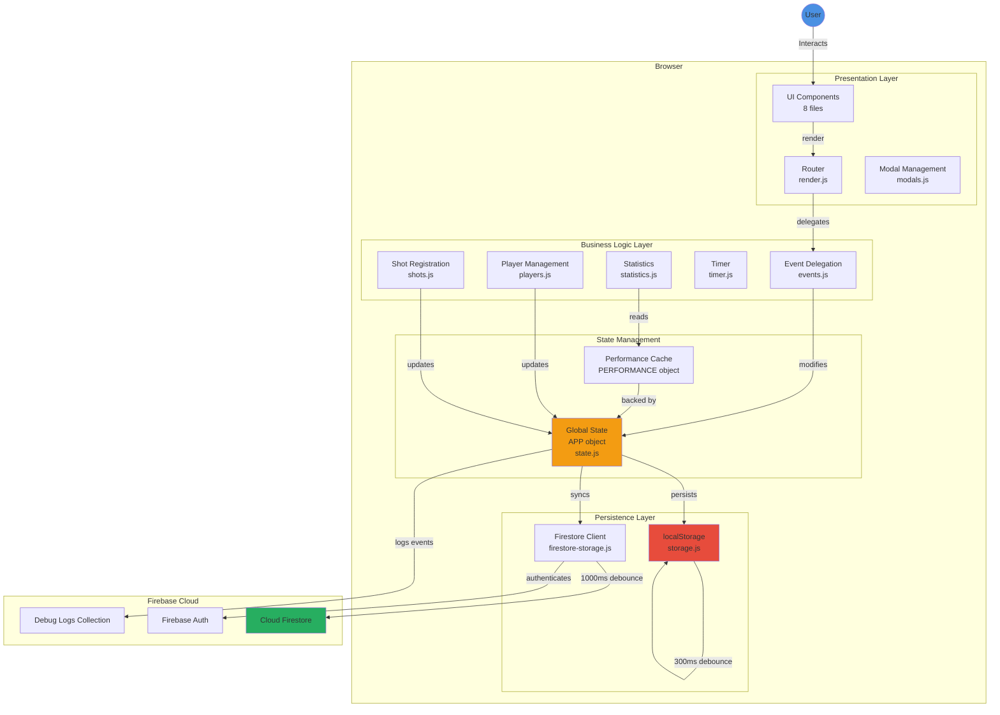

### Technology Stack

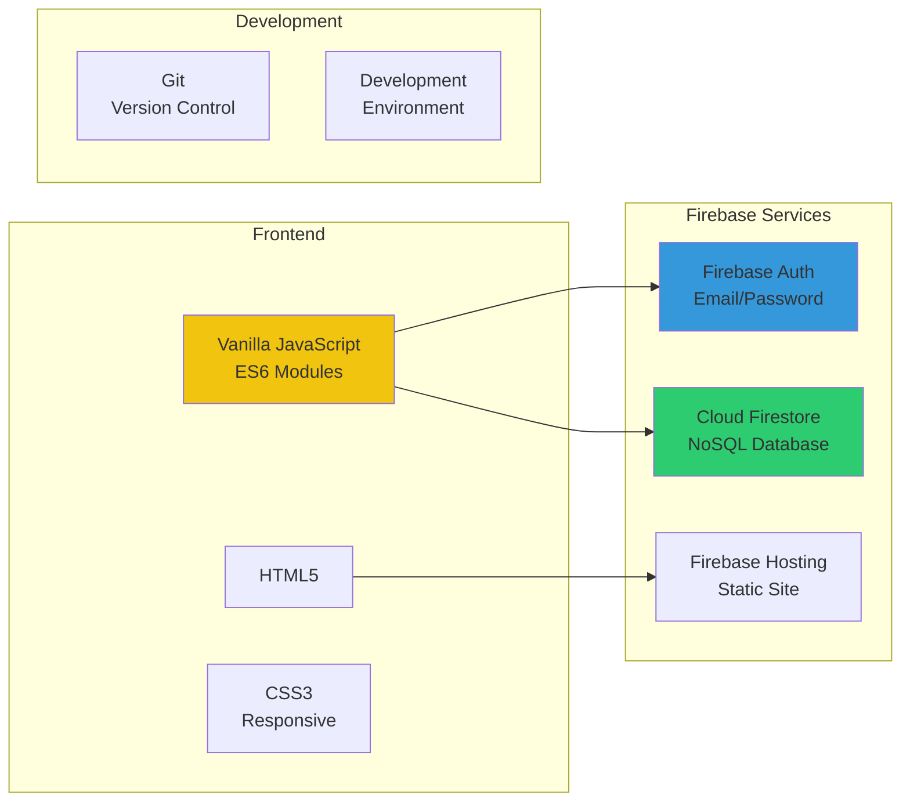

---

## 2. FIL-AVHENGIGHETER

### Complete Dependency Graph

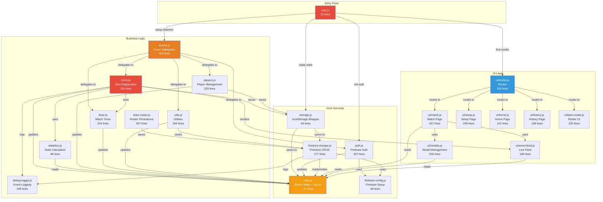

### Critical Path for Shot Registration

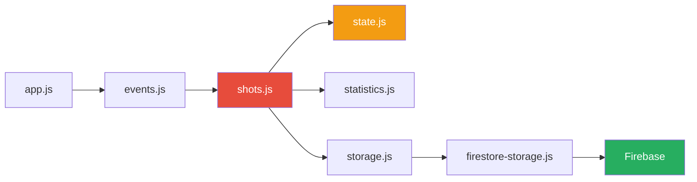

---

## 3. DATAFLYT: SKUDDREGISTRERING

### Complete Shot Registration Flow

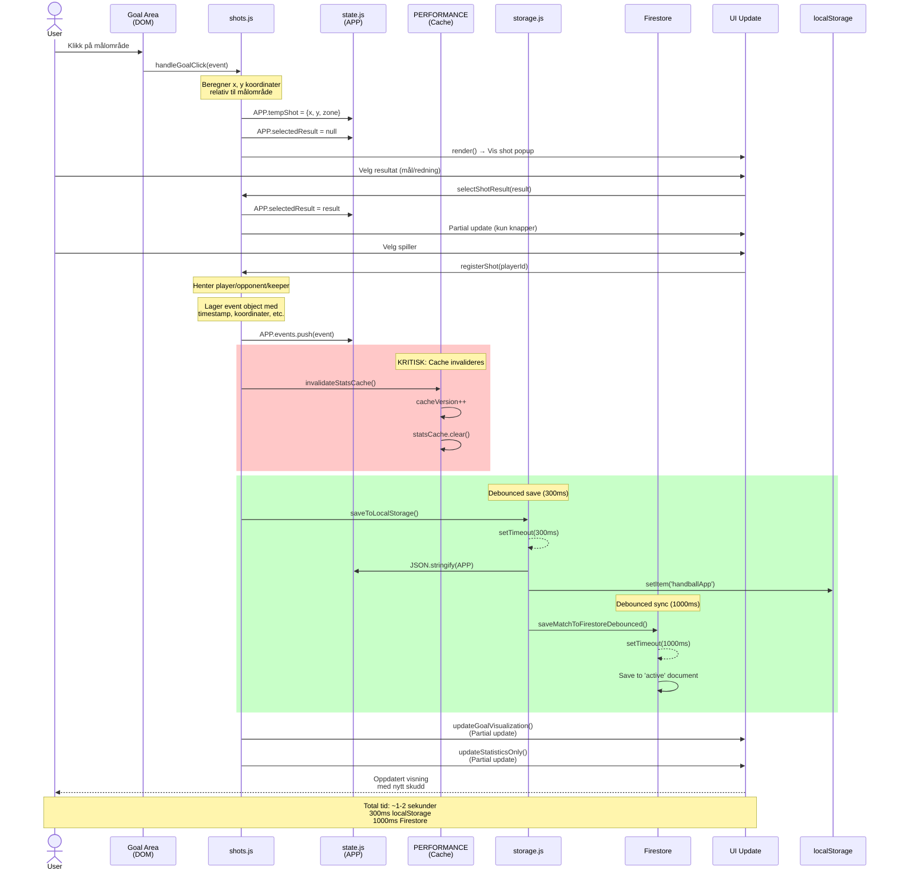

### Shot Event Object Structure

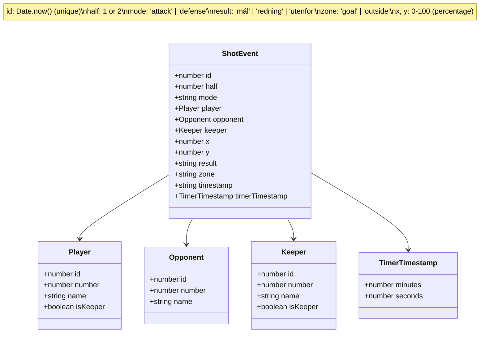

### Coordinate System

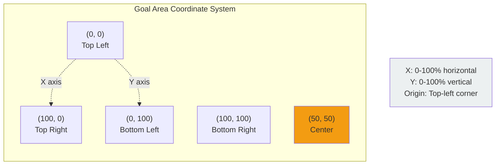

---

## 4. LAGRINGSSTRATEGI

### Dual Storage Architecture

```mermaid
graph TB
    subgraph "Application State"
        APP[APP Object<br/>In-Memory State]
    end

    subgraph "Local Storage Strategy"
        LocalSave[saveToLocalStorage<br/>Debounce: 300ms]
        LocalData[(localStorage<br/>'handballApp')]
        LocalLoad[loadFromLocalStorage<br/>On App Start]
    end

    subgraph "Cloud Storage Strategy"
        FirestoreSave[saveMatchToFirestore<br/>Debounce: 1000ms]
        FirestoreData[(Firestore<br/>users/{uid}/matches)]
        FirestoreLoad[syncFromFirestore<br/>On Auth]
    end

    subgraph "Sync Events"
        Event1[New Shot]
        Event2[Player Added]
        Event3[Match Finished]
        Event4[Setup Reset]
    end

    Event1 --> APP
    Event2 --> APP
    Event3 --> APP
    Event4 --> APP

    APP -->|Triggers| LocalSave
    LocalSave -->|After 300ms| LocalData

    APP -->|Triggers| FirestoreSave
    FirestoreSave -->|After 1000ms| FirestoreData

    LocalData -->|On Reload| LocalLoad
    LocalLoad -->|Restores| APP

    FirestoreData -->|On Login| FirestoreLoad
    FirestoreLoad -->|Overwrites| APP

    style APP fill:#f39c12,color:#fff
    style LocalData fill:#e74c3c,color:#fff
    style FirestoreData fill:#27ae60,color:#fff
```

### Storage Comparison

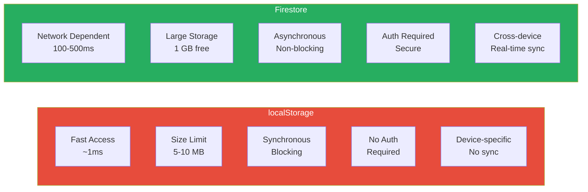

### Data Flow Priority

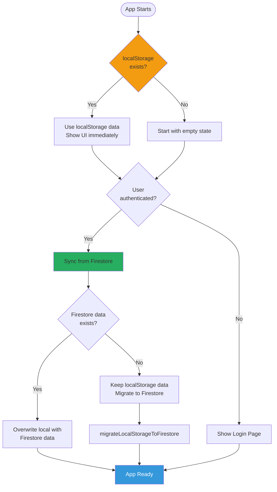

### Save Debouncing Strategy

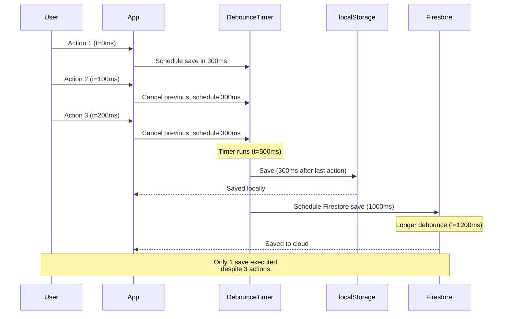

---

## 5. STATE MANAGEMENT

### Global APP Object Structure

```mermaid
graph TB
    subgraph "APP Object (state.js)"
        subgraph "User State"
            currentUser[currentUser<br/>Firebase User]
        end

        subgraph "Navigation State"
            page[page: string<br/>'home'|'match'|'setup'|etc]
        end

        subgraph "Match Configuration"
            homeTeam[homeTeam: string]
            awayTeam[awayTeam: string]
            matchDate[matchDate: string]
            currentHalf[currentHalf: 1|2]
            matchMode[matchMode: 'simple'|'advanced']
        end

        subgraph "Teams"
            players[players: Array~Player~]
            opponents[opponents: Array~Opponent~]
            activeKeeper[activeKeeper: Keeper]
        end

        subgraph "Match Events"
            events[events: Array~ShotEvent~]
            mode[mode: 'attack'|'defense']
        end

        subgraph "Timer State (Advanced)"
            timerState[timerState: Object<br/>currentTime, isRunning,<br/>duration, intervalId]
        end

        subgraph "Temporary UI State"
            tempShot[tempShot: {x, y, zone}]
            selectedResult[selectedResult: string]
            tempPlayersList[tempPlayersList: Array]
            editingPlayerId[editingPlayerId: number]
        end

        subgraph "History"
            completedMatches[completedMatches: Array~Match~]
            viewingMatch[viewingMatch: Match]
        end

        subgraph "Saved Rosters"
            savedTeams[savedTeams: Array~TeamRoster~]
        end
    end

    style APP fill:#f39c12,color:#fff
    style events fill:#e74c3c,color:#fff
    style tempShot fill:#3498db,color:#fff
```

### Performance Cache Structure

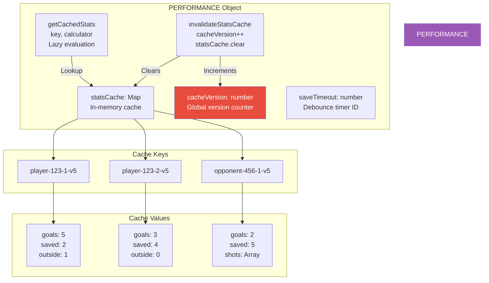

### Cache Invalidation Flow


---

## 6. FIREBASE ARKITEKTUR

### Firestore Database Schema

```mermaid
graph TB
    subgraph "Firestore Database"
        root[(Cloud Firestore)]

        subgraph "Users Collection"
            users[users/]
            user1[{uid1}]
            user2[{uid2}]

            users --> user1
            users --> user2
        end

        root --> users

        subgraph "User Document Fields"
            userFields["email: string<br/>name: string<br/>homeTeam: string<br/>migrated: boolean<br/>migratedAt: timestamp"]
        end

        user1 --> userFields

        subgraph "Matches Subcollection"
            matches[matches/]
            activeDoc['active']
            match1[{matchId1}]
            match2[{matchId2}]

            matches --> activeDoc
            matches --> match1
            matches --> match2
        end

        user1 --> matches

        subgraph "Match Document Fields"
            matchFields["homeTeam: string<br/>awayTeam: string<br/>matchDate: string<br/>currentHalf: 1|2<br/>players: Array<br/>opponents: Array<br/>events: Array<br/>activeKeeper: Object<br/>mode: string<br/>status: 'active'|'completed'<br/>updatedAt: timestamp<br/>completedAt: timestamp"]
        end

        activeDoc --> matchFields
        match1 --> matchFields

        subgraph "Debug Logs Collection"
            debugLogs[debug-logs/]
            log1[{logId1}]
            log2[{logId2}]

            debugLogs --> log1
            debugLogs --> log2
        end

        root --> debugLogs

        subgraph "Debug Log Fields"
            logFields["userId: string<br/>userEmail: string<br/>eventType: string<br/>data: Object<br/>timestamp: string<br/>appVersion: string<br/>browser: string"]
        end

        log1 --> logFields
    end

    style root fill:#27ae60,color:#fff
    style users fill:#3498db,color:#fff
    style debugLogs fill:#e67e22,color:#fff
```

### Firebase Authentication Flow

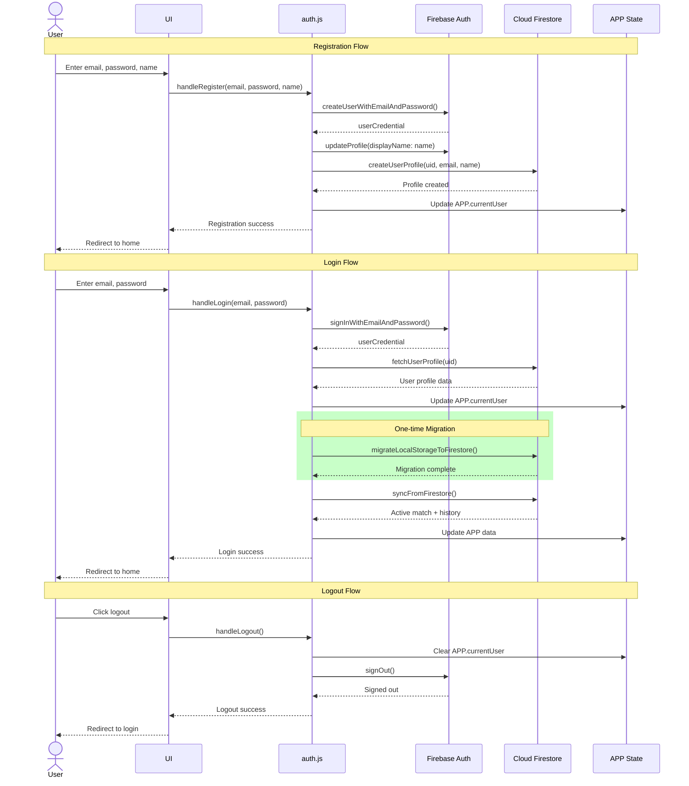

### Firestore Operations

```mermaid
graph TB
    subgraph "Read Operations"
        R1[loadActiveMatchFromFirestore<br/>Load current match]
        R2[loadCompletedMatchesFromFirestore<br/>Load history]
        R3[fetchUserProfile<br/>Load user data]
        R4[fetchSavedTeams<br/>Load rosters]
    end

    subgraph "Write Operations"
        W1[saveMatchToFirestore<br/>Save active match<br/>debounced 1000ms]
        W2[saveCompletedMatchToFirestore<br/>Archive finished match]
        W3[createUserProfile<br/>Create user document]
        W4[saveTeamRoster<br/>Save team list]
    end

    subgraph "Delete Operations"
        D1[deleteCompletedMatchFromFirestore<br/>Remove match from history]
        D2[deleteTeamRoster<br/>Remove saved team]
    end

    subgraph "Special Operations"
        S1[migrateLocalStorageToFirestore<br/>One-time data migration]
        S2[syncFromFirestore<br/>Full sync on login]
    end

    subgraph "Firestore Collections"
        C1[(users/{uid})]
        C2[(users/{uid}/matches)]
        C3[(debug-logs)]
    end

    R1 --> C2
    R2 --> C2
    R3 --> C1
    R4 --> C1

    W1 --> C2
    W2 --> C2
    W3 --> C1
    W4 --> C1

    D1 --> C2
    D2 --> C1

    S1 --> C1
    S1 --> C2
    S2 --> C1
    S2 --> C2

    style C1 fill:#3498db,color:#fff
    style C2 fill:#27ae60,color:#fff
    style C3 fill:#e67e22,color:#fff
```

---

## 7. UI RENDERING FLOW

### Page Routing System


### Rendering Strategy

```mermaid
graph TB
    subgraph "Full Re-render (Heavy)"
        F1[User navigates to new page]
        F2[APP.page changes]
        F3[render called]
        F4[Entire #app innerHTML replaced]
        F5[All event listeners re-attached]
    end

    subgraph "Partial Update (Optimized)"
        P1[User registers shot]
        P2[Event data added to APP.events]
        P3[updateGoalVisualization]
        P4[Only shot markers updated]
        P5[updateStatisticsOnly]
        P6[Only stats section updated]
    end

    subgraph "Modal Update (Lazy)"
        M1[User selects shot result]
        M2[APP.selectedResult updated]
        M3[selectShotResult]
        M4[Only result buttons updated]
        M5[No full re-render]
    end

    F1 --> F2 --> F3 --> F4 --> F5
    P1 --> P2 --> P3 --> P4
    P2 --> P5 --> P6
    M1 --> M2 --> M3 --> M4 --> M5

    style F4 fill:#e74c3c,color:#fff
    style P4 fill:#27ae60,color:#fff
    style P6 fill:#27ae60,color:#fff
    style M4 fill:#f39c12,color:#fff
```

---

## 8. EVENT HANDLING STRATEGY

### Global Event Delegation

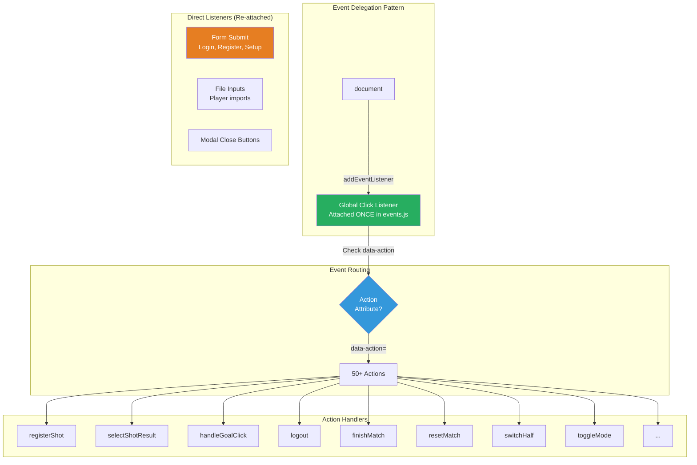

### Event Flow Example

```mermaid
sequenceDiagram
    actor User
    participant DOM
    participant GlobalListener
    participant EventsJS as events.js
    participant ShotsJS as shots.js
    participant State as APP State
    participant UI

    User->>DOM: Click button<br/>data-action="registerShot"<br/>data-player-id="123"
    DOM->>GlobalListener: click event bubbles up
    GlobalListener->>EventsJS: Check e.target.dataset.action

    EventsJS->>EventsJS: action === 'registerShot'
    EventsJS->>ShotsJS: registerShot(playerId=123)

    ShotsJS->>State: APP.events.push(event)
    ShotsJS->>State: PERFORMANCE.invalidateStatsCache()
    ShotsJS->>UI: updateGoalVisualization()
    ShotsJS->>UI: updateStatisticsOnly()

    UI-->>User: Updated display

    Note over GlobalListener,EventsJS: Single listener handles<br/>all actions via delegation
```

---

## 9. ARKITEKTUR-INSIGHTS

### Styrker

1. **Enkel State Management**
   - Ett globalt objekt, lett å debugge
   - Ingen kompleks state-synkronisering

2. **Dual Persistence**
   - localStorage for rask tilgang
   - Firestore for backup og sync
   - Debouncing reduserer database-writes

3. **Event Delegation**
   - Ett event listener for alle knapper
   - Ingen listener leaks fra knapper
   - Fungerer med dynamisk DOM

4. **Partial Updates**
   - Ikke full re-render ved hver endring
   - Bedre ytelse på store kamper

5. **Versioned Caching**
   - Enkel invalidering (increment version)
   - Lazy evaluation av stats

### Svakheter

1. **Global State**
   - Ingen innkapsling
   - Lett å mutere feil fra hvor som helst
   - Vanskelig å skalere

2. **Modal Event Listeners**
   - Re-attached ved hver render
   - Potensielle memory leaks

3. **Ingen TypeScript**
   - Ingen compile-time validering
   - Vanskelig å refaktorere trygt

4. **Stor events.js**
   - 562 linjer, vanskelig å vedlikeholde
   - Bør splittes i moduler

5. **Race Conditions**
   - Debounced saves kan miste data
   - Timing issues ved rask input

### Forbedringspotensial

1. Introduser state setter-funksjoner med validering
2. Implementer modal state machine
3. Split events.js i feature-moduler
4. Legg til TypeScript (gradvis migrasjon)
5. Implementer konfliktløsning for Firestore sync
6. Legg til comprehensive error handling

---

**Dokument versjon:** 1.0
**Sist oppdatert:** 2026-01-12
**Laget av:** Claude Code Agent
